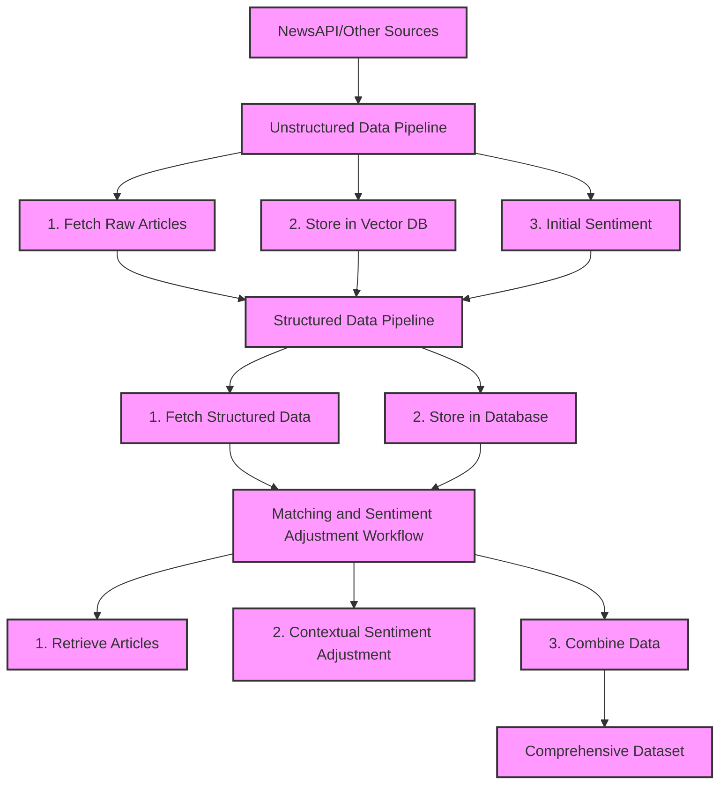

ChatGPT: 
- Your architectural summary is quite comprehensive and well-structured. It includes the key components and workflows needed to achieve your goal. Here are some additional considerations and potential optimizations to ensure the solution is as elegant and streamlined as possible:
### Architectural Summary: 
1. **Unstructured Data Pipeline:**  
- **Fetching Articles:**  Fetch raw news articles using an API like NewsAPI. 
- **Storing Articles in Vector DB:**  Store the fetched articles in a vector database for efficient retrieval and similarity searches. 
- **Sentiment Analysis:**  Perform initial sentiment analysis on the articles and store the results in the vector database alongside the raw articles. 
2. **Structured Data Pipeline:**  
- **Fetching Structured Data:**  Fetch structured financial data (e.g., stock quotes) using an API like Alpha Vantage. 
- **Storing Structured Data:**  Store the structured data in a traditional database or data warehouse. 
3. **Matching and Sentiment Adjustment Workflow:**  
- **Retrieving Articles:**  Retrieve relevant articles from the vector database based on the structured data (e.g., ticker symbols). 
- **Contextual Sentiment Adjustment:**  Adjust the sentiment of the articles based on their relevance to the company, considering competitive context (e.g., negative news about a competitor might be positive for the company). 
- **Combining Data:**  Combine the adjusted sentiment data with the structured financial data to create a comprehensive dataset.
### Potential Optimizations: 
1. **Batch Processing:**  
- **Batch Fetching:**  Fetch articles and structured data in batches to reduce the number of API calls and improve performance. 
- **Batch Sentiment Analysis:**  Perform sentiment analysis in batches to leverage parallel processing capabilities. 
2. **Caching Mechanism:** 
- Implement a caching mechanism to store intermediate results, reducing the need for repeated computations and API calls. 
3. **Incremental Updates:** 
- Instead of reprocessing all data, implement incremental updates to only process new articles and new structured data entries. 
4. **Parallel Processing:** 
- Use parallel processing for tasks like sentiment analysis and article retrieval to speed up the workflow. 
5. **Logging and Monitoring:** 
- Implement comprehensive logging and monitoring to track the performance of each pipeline and quickly identify bottlenecks or errors. 
6. **Scalability:** 
- Design the system to be scalable, using cloud services and auto-scaling features to handle increased data volumes. 
7. **Data Validation:** 
- Ensure robust data validation at each step to handle missing or malformed data gracefully.
### Refined Architecture Diagram:

```plaintext
+-----------------------------+
                                  |    NewsAPI/Other Sources     |
                                  +-------------+---------------+
                                                |
                                                v
                            +---------------------------+
                            |  Unstructured Data Pipeline |
                            +---------------------------+
                            | 1. Fetch Raw Articles     |
                            | 2. Store in Vector DB     |
                            | 3. Initial Sentiment      |
                            +---------------------------+
                                                |
                                                v
                            +----------------------------+
                            |     Structured Data Pipeline |
                            +----------------------------+
                            | 1. Fetch Structured Data    |
                            | 2. Store in Database        |
                            +----------------------------+
                                                |
                                                v
                            +----------------------------+
                            | Matching and Sentiment      |
                            | Adjustment Workflow         |
                            +----------------------------+
                            | 1. Retrieve Articles       |
                            | 2. Contextual Sentiment    |
                            |    Adjustment              |
                            | 3. Combine Data            |
                            +----------------------------+
                                                |
                                                v
                            +----------------------------+
                            |    Comprehensive Dataset    |
                            +----------------------------+
```


### Refined Architecture with OpenAI Integration:

Here’s how you can structure your architecture with OpenAI models for sentiment analysis and contextual understanding: 
1. **Unstructured Data Pipeline:** 
- Fetch raw news articles using an API like NewsAPI.
- Store the fetched articles in a vector database for efficient retrieval and similarity searches.
- Use OpenAI models for initial sentiment analysis on the articles and store the results in the vector database alongside the raw articles. 
2. **Structured Data Pipeline:** 
- Fetch structured financial data (e.g., stock quotes) using an API like Alpha Vantage.
- Store the structured data in a traditional database or data warehouse. 
3. **Matching and Sentiment Adjustment Workflow:** 
- Retrieve relevant articles from the vector database based on the structured data (e.g., ticker symbols).
- Use OpenAI models to adjust the sentiment of the articles based on their relevance to the company, considering competitive context.
- Combine the adjusted sentiment data with the structured financial data to create a comprehensive dataset.
### Implementation Example with OpenAI:

```python
from dotenv import load_dotenv
import os
import openai
from alpha_vantage.timeseries import TimeSeries
from newsapi import NewsApiClient
from typing import List, Dict
from vector_db import VectorDB  # Hypothetical vector database library

# Initialize OpenAI API
openai.api_key = os.getenv("OPENAI_API_KEY")

# Initialize vector database
vector_db = VectorDB()

# Function to fetch structured data from Alpha Vantage
def fetch_structured_data(api_key: str, tickers: List[str]) -> Dict[str, Dict]:
    ts = TimeSeries(key=api_key, output_format='pandas')
    data = {}
    for ticker in tickers:
        data[ticker], _ = ts.get_quote_endpoint(symbol=ticker)
    return data

# Function to fetch unstructured data from NewsAPI
def fetch_news(api_key: str, query: str, num_articles: int) -> List[Dict]:
    newsapi = NewsApiClient(api_key=api_key)
    articles = newsapi.get_everything(q=query, language='en', page_size=num_articles)
    return [{"title": article['title'], "description": article['description']} for article in articles['articles']]

# Function to store articles in vector database
def store_articles_in_vector_db(articles: List[Dict]):
    for article in articles:
        article_text = article['title'] + " " + article['description']
        vector_db.store(article_text)

# Function to filter news articles relevant to the tickers using OpenAI
def filter_relevant_news_llm(tickers: List[str], news_articles: List[Dict]) -> Dict[str, List[str]]:
    relevant_news = {ticker: [] for ticker in tickers}
    for article in news_articles:
        article_text = article['title'] + " " + article['description']
        response = openai.Completion.create(
            engine="text-davinci-003",
            prompt=f"Is this article relevant to any of the following tickers: {', '.join(tickers)}? If yes, which one and why?\n\nArticle: {article_text}\n\nAnswer:",
            max_tokens=150
        )
        answer = response.choices[0].text.strip()
        for ticker in tickers:
            if ticker in answer:
                relevant_news[ticker].append(article_text)
    return relevant_news

# Function to classify sentiment of financial news using OpenAI
def analyze_market_sentiment(news_articles: List[str]) -> List[str]:
    sentiments = []
    for article in news_articles:
        sentiment = openai.Completion.create(
            engine="text-davinci-003",
            prompt=f"Analyze the sentiment of this article and determine if it's positive, negative, or neutral: {article}",
            max_tokens=60
        )
        sentiments.append(sentiment.choices[0].text.strip())
    return sentiments

# Function to adjust sentiment based on context using OpenAI
def adjust_sentiment_based_on_context(article: str, sentiment: str, ticker: str) -> str:
    response = openai.Completion.create(
        engine="text-davinci-003",
        prompt=f"Given the following article: {article}\n\nThe sentiment is '{sentiment}'. Considering the ticker '{ticker}', should this sentiment be adjusted? If yes, to what and why?",
        max_tokens=150
    )
    return response.choices[0].text.strip()

if __name__ == "__main__":

    # Load environment variables from .env file
    load_dotenv()

    # Sample tickers to analyze
    tickers = ["AAPL", "GOOGL", "AMZN"]

    # Fetch structured data
    alpha_vantage_api_key = os.getenv('ALPHA_VANTAGE_API_KEY')
    structured_data = fetch_structured_data(alpha_vantage_api_key, tickers)

    # Fetch financial news articles using NewsAPI
    news_api_key = os.getenv('NEWS_API_KEY')
    news_articles = fetch_news(news_api_key, 'stocks', 50)

    # Ensure the keys are loaded
    if not alpha_vantage_api_key or not news_api_key:
        raise ValueError("API keys not found. Please check your .env file.")

    # Store raw articles in vector database
    store_articles_in_vector_db(news_articles)

    # Filter news articles relevant to the tickers using OpenAI
    relevant_news = filter_relevant_news_llm(tickers, news_articles)

    # Analyze the sentiment of the relevant news articles
    combined_data = []
    for ticker, articles in relevant_news.items():
        if articles:
            sentiments = analyze_market_sentiment(articles)
            for article, sentiment in zip(articles, sentiments):
                adjusted_sentiment = adjust_sentiment_based_on_context(article, sentiment, ticker)
                combined_data.append({
                    "article": article,
                    "sentiment": adjusted_sentiment,
                    "ticker": ticker,
                    "structured_data": structured_data[ticker].to_dict()  # This should be mapped to relevant info
                })

    # Print combined data
    for data in combined_data:
        print(data)
```


### Summary: 
- **OpenAI Integration:**  Using OpenAI models for filtering, sentiment analysis, and contextual sentiment adjustment. 
- **Vector Database:**  Efficient storage and retrieval of articles and sentiments. 
- **Batch Processing and Parallelization:**  Improve performance and scalability. 
- **Comprehensive Data Combining:**  Adjusted sentiments based on competitive context combined with structured data.

This approach leverages the advanced capabilities of OpenAI models to enhance the intelligence and accuracy of your NLP tasks while ensuring efficient data management and processing with a vector database.





This version correctly displays each step within the respective pipelines and workflows without extraneous node labels.
